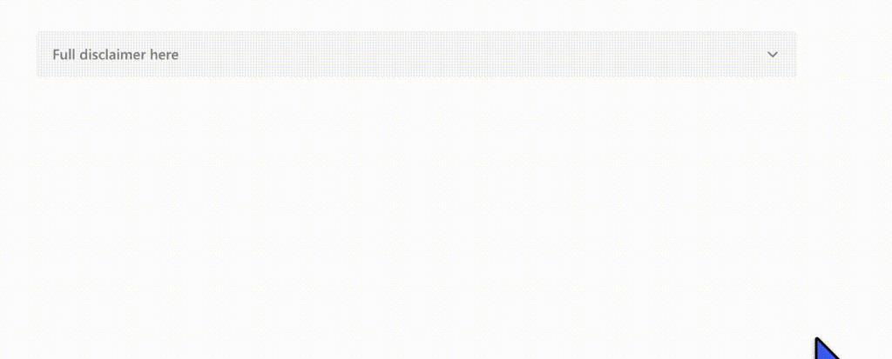

# Single Accordion — SPFx Web Part


A production-ready SharePoint Framework (SPFx) web part that renders a single expandable/collapsible accordion section on any modern SharePoint page. Designed for scenarios where you need to tuck away long-form supporting content — disclaimers, policies, legal text, notes — without overwhelming the page visually.

---

## Preview



---

## What It Does

An author places the **Single Accordion** web part anywhere on a modern SharePoint page. Visitors see a clean, clickable trigger row (e.g. *"Full disclaimer here"*). Clicking it smoothly expands a rich-text content area beneath. Clicking again collapses it. Everything — text, colors, typography, icon style, width, animation speed — is configurable from the property pane without writing a single line of code.

### Primary use cases

- Full disclaimer text below a short summary statement
- "Read the full policy" expandable section
- Supplementary or supporting notes that don't need to be visible by default
- Legal or compliance copy that must be accessible but should stay out of the way

---

## Features

### Content
- Editable accordion trigger label (defaults to *"Full disclaimer here"*)
- Rich HTML body content (supports `<p>`, `<b>`, `<i>`, `<ul>/<li>`, `<a>`, `<h2>`–`<h4>`, and more)
- Option to start expanded or collapsed by default
- Optional web part title above the accordion (show/hide toggle)

### Layout & Width
- Full-width mode or custom max-width (px, %, or rem)
- Container alignment: left, center, or right
- Configurable top and bottom margins

### Trigger Styling
- Font family, size, weight, and color
- Background color — separate values for open and closed states
- Border color — separate values for open and closed states
- Border radius, vertical/horizontal padding, minimum row height
- Text alignment (left, center, right)
- Text wrapping on/off
- Choose whether clicking the **entire row** toggles the accordion, or only the text and icon

### Body Content Styling
- Font family, size, weight, line height, and color
- Background color, padding, border, border radius
- Text alignment

### Icon Options
- Show or hide the icon entirely
- Four icon styles: **Chevron**, **Caret**, **Plus / Minus**, **Arrow**
- Four placement options: far left, far right, before text, after text
- Configurable icon size and color
- Rotation animation on expand/collapse (can be disabled)

### Advanced / Behavior
- Divider line between trigger and content (on/off)
- Box shadow (on/off)
- Transition duration (0–800 ms, adjustable via slider)
- Compact mode for tighter spacing

### Accessibility
- Trigger is a native `<button>` — fully keyboard operable
- `aria-expanded` communicates open/closed state to screen readers
- `aria-controls` links the trigger to its content region
- Content region uses `role="region"` + `aria-labelledby`
- `hidden` attribute removes collapsed content from the accessibility tree
- Visible `:focus-visible` outline meets WCAG 2.4.7
- Icon SVGs are `aria-hidden` so they do not appear as phantom interactive elements

---

## Compatibility

| Requirement | Version |
|---|---|
| SharePoint Framework | 1.20.0 |
| Node.js | 18.x |
| React | 17.0.1 |
| TypeScript | 4.7.4 |
| Supported hosts | SharePoint modern pages, SharePoint full-page app, Microsoft Teams (personal app & tab) |

---

## Getting Started

### Option A — Deploy the pre-built package (no build tools needed)

1. Download `sharepoint/solution/custom-accordion-webpart.sppkg` from this repository.
2. Upload it to your **SharePoint App Catalog**:
   - Tenant-wide: SharePoint Admin Center → Apps → App Catalog → Upload
   - Site-scoped: `https://yourtenant.sharepoint.com/sites/yoursite/_layouts/15/tenantAppCatalog.aspx`
3. When prompted, select **"Make this solution available to all sites in the organization"** (recommended — the solution uses `skipFeatureDeployment: true` so no per-site installation is required).
4. Open any modern SharePoint page in **Edit** mode, click **+**, search for **Single Accordion** under *Text, media, and content*, and add it.

### Option B — Build from source

#### Prerequisites

- [Node.js 18.x](https://nodejs.org/)
- [Gulp CLI](https://gulpjs.com/) — `npm install -g gulp-cli`

#### Steps

```bash
# 1. Clone the repository
git clone https://github.com/YOUR_USERNAME/custom-accordion-webpart.git
cd custom-accordion-webpart

# 2. Install dependencies
npm install

# 3a. Run locally against the SharePoint Workbench
gulp serve

# 3b. OR build and package for deployment
gulp bundle --ship
gulp package-solution --ship
# → Output: sharepoint/solution/custom-accordion-webpart.sppkg
```

Then follow the deployment steps in Option A above.

---

## Property Pane Reference

The property pane is split into two pages to keep things manageable.

### Page 1

| Group | Key settings |
|---|---|
| **Content** | Trigger text, body HTML, default expanded state, web part title |
| **Layout & Width** | Width mode (full / custom), max width, unit, alignment, margins |
| **Trigger Styling** | Font, colors (open & closed states), border, radius, padding, min height, click area |
| **Icon Settings** | Show/hide, style (chevron/caret/plus-minus/arrow), placement, size, color, animation |

### Page 2

| Group | Key settings |
|---|---|
| **Body Styling** | Font, line height, colors, padding, border, alignment, top spacing |
| **Advanced / Behavior** | Divider, box shadow, transition duration, compact mode |

---

## Project Structure

```
custom-accordion-webpart/
├── config/
│   ├── package-solution.json       # Solution metadata, icon path
│   └── ...
├── docs/
│   └── assets/
│       └── preview.png             # README preview image
├── sharepoint/
│   ├── images/
│   │   └── single-accordion.png    # App catalog icon
│   └── solution/
│       └── custom-accordion-webpart.sppkg
├── src/
│   └── webparts/
│       └── customAccordion/
│           ├── components/
│           │   ├── CustomAccordion.tsx         # React component
│           │   ├── CustomAccordion.module.scss # SCSS styles
│           │   └── ICustomAccordionProps.ts    # TypeScript props interface
│           ├── utils/
│           │   ├── sanitizeHtml.ts             # Allowlist HTML sanitizer
│           │   └── useId.ts                    # React 17 useId polyfill
│           ├── loc/
│           │   ├── en-us.js                    # String resources
│           │   └── mystrings.d.ts              # String type declarations
│           ├── CustomAccordionWebPart.ts       # Web part class + property pane
│           └── CustomAccordionWebPart.manifest.json
└── package.json
```

---

## Version History

| Version | Date | Notes |
|---|---|---|
| 1.0.0 | March 2026 | Initial release |

---

## Disclaimer

**THIS CODE IS PROVIDED *AS IS* WITHOUT WARRANTY OF ANY KIND, EITHER EXPRESS OR IMPLIED, INCLUDING ANY IMPLIED WARRANTIES OF FITNESS FOR A PARTICULAR PURPOSE, MERCHANTABILITY, OR NON-INFRINGEMENT.**

---

## References

- [SharePoint Framework overview](https://docs.microsoft.com/en-us/sharepoint/dev/spfx/sharepoint-framework-overview)
- [SPFx web part property pane](https://docs.microsoft.com/en-us/sharepoint/dev/spfx/web-parts/guidance/integrate-web-part-properties-with-sharepoint)
- [Fluent UI React v8](https://developer.microsoft.com/en-us/fluentui#/)
- [WCAG 2.1 Accordion pattern](https://www.w3.org/WAI/ARIA/apg/patterns/accordion/)
- [Microsoft 365 Patterns and Practices](https://aka.ms/m365pnp)
